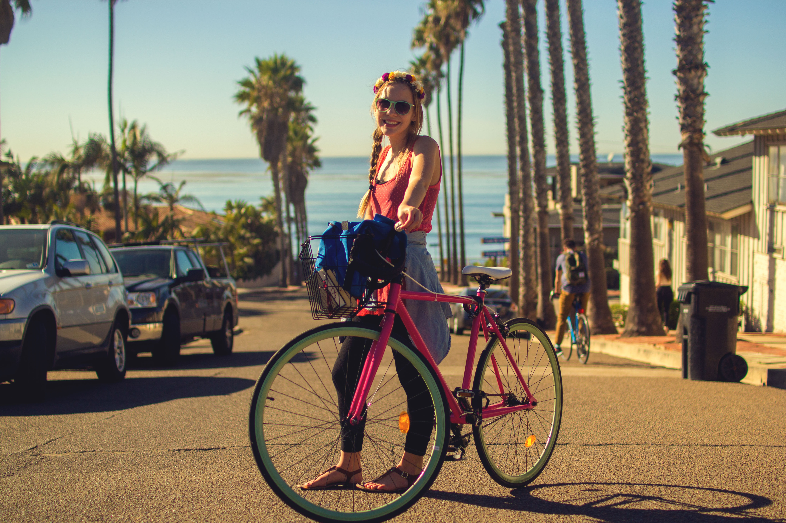
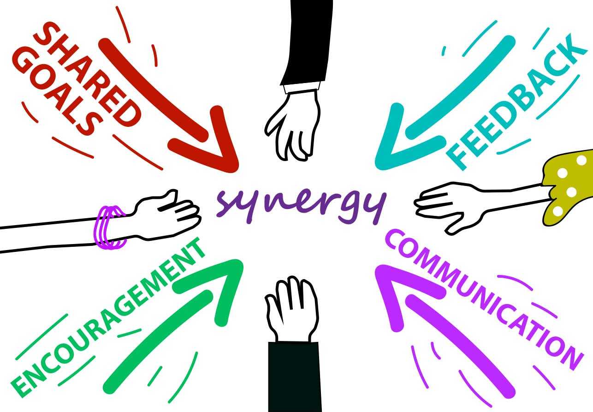
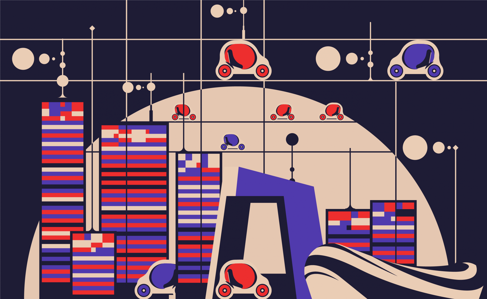
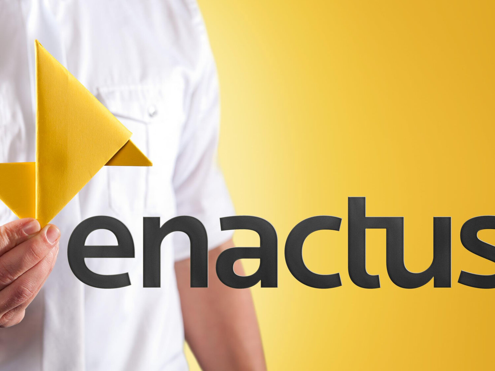

<html lang="en">
<head>
  <meta charset="utf-8">
  <title>Jiajin Li Profile</title>
  <meta content="width=device-width, initial-scale=1.0" name="viewport">
  <meta content="" name="keywords">
  <meta content="" name="description">

  <!-- Favicons -->
  <link href="img/favicon.png" rel="icon">
  <link href="img/apple-touch-icon.png" rel="apple-touch-icon">

  <!-- Bootstrap CSS File -->
  <link href="lib/bootstrap/css/bootstrap.min.css" rel="stylesheet">

  <!-- Libraries CSS Files -->
  <link href="lib/font-awesome/css/font-awesome.min.css" rel="stylesheet">
  <link href="lib/animate/animate.min.css" rel="stylesheet">
  <link href="lib/ionicons/css/ionicons.min.css" rel="stylesheet">
  <link href="lib/owlcarousel/assets/owl.carousel.min.css" rel="stylesheet">
  <link href="lib/lightbox/css/lightbox.min.css" rel="stylesheet">

  <!-- Main Stylesheet File -->
  <link href="css/style.css" rel="stylesheet">

  <!-- =======================================================
    Theme Name: DevFolio
    Theme URL: https://bootstrapmade.com/devfolio-bootstrap-portfolio-html-template/
    Author: BootstrapMade.com
    License: https://bootstrapmade.com/license/
  ======================================================= -->
</head>

<body id="page-top">

  <!--/ Nav Star /-->
  <nav class="navbar navbar-b navbar-trans navbar-expand-md fixed-top" id="mainNav">
    

      <a class="navbar-brand js-scroll" href="#page-top">Enjoy the thrill</a>
      <button class="navbar-toggler collapsed" type="button" data-toggle="collapse" data-target="#navbarDefault"
        aria-controls="navbarDefault" aria-expanded="false" aria-label="Toggle navigation">
        
        
        
      </button>
      

        <ul class="navbar-nav">
          <li class="nav-item">
            <a class="nav-link js-scroll active" href="#home">HOME</a>
          </li>
          <li class="nav-item">
            <a class="nav-link js-scroll" href="#about">ABOUT ME</a>
          </li>
          <li class="nav-item">
            <a class="nav-link js-scroll" href="#service">MY EDUCATION</a>
          </li>
          <li class="nav-item">
            <a class="nav-link js-scroll" href="#work">MY PROJECT</a>
          </li>
          <li class="nav-item">
            <a class="nav-link js-scroll" href="#blog">MY PODCAST</a>
          </li>
          <li class="nav-item">
            <a class="nav-link js-scroll" href="#contact">Contact</a>
          </li>
        </ul>
      

    

  </nav>
  <!--/ Nav End /-->

  <!--/ Intro Skew Star /-->
  

    

    

      

        

          <!--
Hello, world!
-->
          <h1 class="intro-title mb-4">I am Jiajin Li</h1>
          
A 100% “slash”: hippie/foodie/cutie,Qualitative Market Researcher,Avid Podcaster,Brand Builder,Creative Communicator, Enthusiastic Prototyper, Future Product Designer<strong class="text-slider"></strong>

          <!-- 
<a class="btn btn-primary btn js-scroll px-4" href="#about" role="button">Learn More</a>
 -->
        

      

    

  

  <!--/ Intro Skew End /-->

  <section id="about" class="about-mf sect-pt4 route">
    

      

        

          

            

              

                

                  

                    

                      
                    

                  

                  

                    

                      
Name:  Jiajin Li

                      
Profile:  Final year Information Studies & Social Computing and English Student

                      
Email:  jiajin.li@ucdconnect.ie

                      
Phone:  0879157119

                    

                  

                

                

                  
Skill

                  HTML 60%
                  

                    

                  

                  Audition CC 90%
                  

                    

                  

                  Figma 50%
                  

                    

                  

                  Premiere Pro 60%
                  

                    

                  

                

              

              

                

                  

                    <h5 class="title-left">
                      About Me
                    </h5>
                  

                  

              
                    I’m a final year Information & Social Computing and English Literature student at UCD. I’m keen to gain insight into the complex relationship among product design, behavioral psychology, and scientific thought, and how this is integral to our society. It reveals some big ideas behind everyday experiences.
                  

                  

               
                    I’ve grown into an active participant in projects with a strong interest in market research, product development, and interactive design. I like to test the solution through a series of moderated sessions to gather user feedback and offer the blueprint and guidance for my team. In my research experience, I’ve developed a curiosity and drive to work through complex problems, strong analytical skills and the ability to understand human behavior. 
                  

                  

                 
                    When I came across the qualitative research role at Kantar, I was happy to learn this experience could be applied to product development in the Auto industry. This means that the problems of real people are always top of mind. AI is highly technical, but we still want to ensure we’re focused on human-centered problems. In my role doing marketing, research, and insights, I have the opportunity to act as the voice of the people buying our products and help guide decision making. I’m motivated to be part of a fast-paced culture where I can shape the future. 
                  

                

              

            

          

        

      

    

  </section>

  <!--/ Section Services Star /-->
  <section id="service" class="services-mf route">
    

      

        

          

            <h3 class="title-a">
              MY EDUCATION
            </h3>
            

             University College Dublin, Dublin, Ireland -- BA Information Studies & Social Computing and English, 2017-2020
            

            

          

        

      

      

        

          

            

              <i class="ion-monitor"></i>
            

            

              <h2 class="s-title">Information Design</h2>
              

            <ol>
            <li>Demonstrate an understanding of data and information produced and consumed in day to day life employing visual means.</li>
            <li>Demonstrate an understanding of information design and related theories and principles.</li>
            <li>Demonstrate knowledge of basic data analysis and manipulation skills.</li>
            <li>Employ basic tools and technique for information design and visualisation.</li>
            <li>Develop an information centric design story.</li>
            </ol> 
            

            

          

        

        

          

            

              <i class="ion-code-working"></i>   
            

            

              <h2 class="s-title">Web Publishing</h2>
              

            <ol>
            <li>Create web pages that are technically accurate, standards-oriented, future-proof and appropriate for their intended purpose.</li>
            <li>Be able to manipulate HTML code directly. </li>
            <li>Apply the tenets of markup language theory to web page development. </li>
            <li>Demonstrate how the World Wide Web and HTML have emerged, how they function and how they are evolving.</li>
            </ol>
            

            

          

        

        

          

            

                <i class="ion-plus-round"></i>
            

            

              <h2 class="s-title">Introduction to Cognitive Science</h2>
              

            <ol> 
            <li>Be appraised of the status of cognitive science and how it relates to its individual contributing disciplines. </li>
            <li>Be familiar with multidisciplinary efforts to characterize perception, action, reasoning, language, and other topics central to cognitive science. </li>
            <li>Have an enhanced critical understanding of the role and significance of behavioral and neuroscientific data and their relation to the person.</li>
            </ol>
            

            

          

        

        

          

            

              <i class="ion-android-phone-portrait"></i>
            

            

              <h2 class="s-title">Information Architecture: Designing the Web</h2>
              

            <ol>
            <li>Evaluate and document the information architecture and navigation of websites for a range of platforms, including mobiles, tablets and desktops.</li>
            <li>Understand the fundamentals of classification, navigation, labelling and search systems and be able to apply these fundamentals to website design.</li>
            <li>Design sitemaps and wireframes.Create basic website metadata.</li>
            </ol>
            

            

          

        

        

          

            

              <i class="ion-paintbrush"></i>
            

            

              <h2 class="s-title">Digital Storytelling</h2>
              

            <ol>
                <li>Understand the essentials of theory and practice in digital storytelling.</li>
                <li>Recognise and evaluate different forms and characteristics of interactive narratives.</li>
                <li>Identify principles of digital storytelling practice for information professionals.</li>
                <li>Create a plan for an interactive digital adaptation following principles learned in this module.</li>
            </ol>
            

            

          

        

        

          

            

              <i class="ion-stats-bars"></i>
            

            

              <h2 class="s-title">Strategic Market Management</h2>
              

              <ol> 
                  <li>To familiarize students with the different contexts in which strategic marketing management can and should occur.</li>
                  <li>Develop the analytical and creative skills required to become innovative strategic marketing managers.</li>
                  <li>To heighten your skills in market analysis and decision making at all levels of the corporate hierarchy.</li>
                  <li>To show how different market contexts and competitive positions call for different strategic responses.</li>
              </ol>
               

            

          

        

      

    

  </section>
  <!--/ Section Services End /-->

  

    

    

      

        

          

            

              <i class="ion-checkmark-round"></i>
            

            

              
10

              PROJECT COMPLETED
            

          

        

        

          

            

              <i class="ion-ios-calendar-outline"></i>
            

            

              
4

              YEARS OF VOLUNTEERING
            

          

        

        

          

            

              <i class="ion-ios-people"></i>
            

            

              
3

              INTERNSHIP DONE
            

          

        

        

          

            

              <i class="ion-ribbon-a"></i>
            

            

              
2

              SCHOLARSHIP WON
            

          

        

      

    

  

  <!--/ Section Portfolio Star /-->
  <section id="work" class="portfolio-mf sect-pt4 route">
    

      

        

          

            <h3 class="title-a">
             MY PROJECT
            </h3>
            

              It’s always "passion o’clock" in case-based analysis and business game-theory scenarios for deconstructing client problems and identifying and innovating solutions. I dive right in to understand a host of human behaviors and how I can design solutions that solve the toughest challenges for them.
            

            

          

        

      

      

        

          

            
              

              

              

                

                  

                      <h2 class="w-title">IDC Practical Training Program</h2>
                    

                      Data Analytics / Sep 2019
                    

                  

                  

                    

                      
                    

                  

                

              

            </a>
          

        

        

          

              
              

              

              

                

                  

                    <h2 class="w-title">Copenhagen Business School Case Competition</h2>
                    

                      Business Analysis /  Feb 2019
                    

                  

                  

                    

                      
                    

                  

                

              

            </a>
          

        

        

          

              
              

              

              

                

                  

                    <h2 class="w-title">Citadel Data Open Competition(Correlation One’s 2018 Dublin Datathon)</h2>
                    

                      Data Analytics / Nov 2018
                    

                  

                  

                    

                      
                    

                  

                

              

            </a>
          

        

        

          

            
              

              

              

                

                  

                    <h2 class="w-title">Innovative Project Cyctrek</h2>
                    

                      Project Management / Mar 2019
                    

                  

                  

                    

                      
                    

                  

                

              

            </a>
          

        

        

          

            
              

              

              

                

                  

                    <h2 class="w-title">MirroEdge(Mobile Product for Generating Outfits)</h2>
                    

                      App Design / Sep 2019
                    

                  

                  

                    

                      
                    

                  

                

              

            </a>
          

        

        

          

            
              

              

              

                

                  

                    <h2 class="w-title">“Accenture Solves” Business Competition</h2>
                    

                      Business Analysis / Oct 2018
                    

                  

                  

                    

                      
                    

                  

                

              

            </a>
          

        

        
      

    

  </section>
  <!--/ Section Portfolio End /-->

  <!--/ Section Testimonials Star /-->
  

    

    

      

        

          

            

              

                
                Yuting Chen---Former Accenture Risk Analyst
              

              

                

                  Jiajin shows me an unquenchable ambition of becoming a pro on things she likes and a strong perseverance in achieving her aims.
                

                <i class="fa fa-quote-right"></i>
              

            

            

              

                
                Robert Dunne---News Acquisition Journalist of Storyful
              

              

                

                I had the pleasure of working with Jiajin during a VR exhibition as part of the Audi Film Festival in 2018 where she successfully assisted those attending the event. In my dealings with Jiajin, she has demonstrated to me that she is very determined and eager to build her skill set.
                

                <i class="fa fa-quote-right"></i>
              

            

          

        

      

    

  

  <!--/ Section Blog Star /-->
  <section id="blog" class="blog-mf sect-pt4 route">
    

      

        

          

            <h3 class="title-a">
            My PODCAST
            </h3>
            

              My Never-Typical, Always-Exciting Podcast Show
            

            

          

        

      

      

        

          

            

              
            

            

              

                

                  <h6 class="category">Travel</h6>
                

              

              <h3 class="card-title"><a href="https://www.mixcloud.com/belfieldfm/buzz-around-china-grand-finalesolo-travel-for-the-soul/" target="_blank">Solo Trip for the Soul</a></h3>
              

              

            China. The name alone makes you want to get packing. It's going places, so jump aboard, go along for the ride and see where it's headed. Wolf down Peking duck in Běijīng, melt over a Chóngqìng hotpot or grab a seasoned ròujiāmó (shredded pork in a bun) before climbing Huá Shān. Gobble down a steaming bowl of Lánzhōu noodles in a Silk Road street market, raise the temperature with some searing Húnán fare or flag down the dim sum trolley down south. Follow your nose in China and you won't want to stop traveling. 
              

            

            

              

                <a href="#">
                  
                  Jiajin Li
                </a>
              

              

                 56 min
              

            

          

        

        

          

            

              
            

            

              

                

                  <h6 class="category">Travel</h6>
                

              

              <h3 class="card-title"><a href="https://www.mixcloud.com/belfieldfm/buss-around-china-my-roommates-travels-in-china/" target="_blank">My Roommate’s Travels in China </a></h3>
              

              

                We say native eyes see native things. The local guide offers an authentic feeling, but travelers do see the city differently. Join me today is Emma and Iain. Both of them have been to China before, as long as two weeks or as short as one day. They do have something interesting and hilarious to share. It takes a lot to land in an exotic place.  
              

            

            

              

                <a href="#">
                  
                  Jiajin Li
                </a>
              

              

                 47 min
              

            

          

        

        

          

            

              
            

            

              

                

                  <h6 class="category">Innovation</h6>
                

              

              <h3 class="card-title"><a href="https://www.mixcloud.com/belfieldfm/this-must-be-the-gig-surabhis-enactus-journey/" target="_blank">Friday Takeaway-Surabhi 's Enactus Journey</a></h3>
              

              

                With me today is Surabhi Agarwal. She is the chairperson at Enactus UCD. Recently, she represented Enactus UCD in the Enactus World Cup 2019. She led an outreach project called “CS Sparks” which helps educate TY girls about coding through microbits and robotics and aims to increase female leaders in technology. Let’s hear about Surabhi’s Enactus journey.
              

            

            

              

                <a href="#">
                  
                  Jiajin Li
                </a>
              

              

                 39 min
              

            

          

        

       

          

            

              
            

            

              

                

                  <h6 class="category">Travel</h6>
                

              

              <h3 class="card-title"><a href="https://www.mixcloud.com/belfieldfm/buzz-around-china-with-gergin-hong-kong/" target="_blank">Buzz Around China with Gergin-Hongkong </a></h3>
              

              

               Hong Kong is a city of experiences. From Dim Sum dining to taking a spin around the harbor on junk, the things to do in Hong Kong are endless. Victoria Harbour, Avenue of Stars, Disneyland, Ocean Park, Lan Kwai Fong, Victoria Peak, Causeway Bay, just name it. How to ace your Hong Kong flight stopover? Well, the hectic pace of this 24-hour city means any stopover is almost like a second holiday. It’s small and densely packed, with everything from frantic street life to sky-high rooftop bars all packed into a postage stamp of an island. 
              

            

            

              

                <a href="#">
                  
                  Jiajin Li
                </a>
              

              

                 60 min
              

            

          

        

           

          

            

              
            

            

              

                

                  <h6 class="category">Innovation</h6>
                

              

              <h3 class="card-title"><a href="https://www.mixcloud.com/belfieldfm/this-must-be-the-gig-big-data-doesnt-have-a-big-sense-of-humour/" target="_blank">Friday Takeaway-Big Data Doesn't Have a Big Sense of Humour</a></h3>
              

              

              Human translation doesn’t just set the standard, it necessarily is the standard.

              Nowadays, we're trying to create technology that you'll want to interact with in deeply emotional ways. So in order to do that, the technology has to be just as much human as it is artificial. 

              What is lost in translation? Will the machine take over a human’s job when it comes to translation? How to bridge the gap between human and artificial intelligence in terms of translation? We human have a hard time explaining the emotions that we have to each other, how can we teach a computer to make sense of them?

            

            

            

            

                <a href="#">
                  
                  Jiajin Li
                </a>
              

              

                 44 min
              

            

          

        

           

          

            

              
            

            

              

                

                  <h6 class="category">Travel</h6>
                

              

              <h3 class="card-title"><a href="https://www.mixcloud.com/belfieldfm/buzz-around-china-with-gergin-harbin/" target="_blank">Buzz Around China with Gergin-Harbin</a></h3>
              

              

              Northeast China is popularly known as 东北 (Dongbei) in Chinese and historically as "Manchuria". It is mainly composed of China's northmost three provinces including Liaoning, Jilin, and Heilongjiang. Not surprisingly, Harbin, capital of Heilongjiang, is used to be nicknamed “Little Moscow”, and the place still looks a little like the last threadbare outpost of imperial Russia. Having a drink of Russian Standard vodka inside a bar made entirely of ice will be the most fantabulous thing in the world.  

            

            

            

              

                <a href="#">
                  
                  Jiajin Li
                </a>
              

              

                 63 min
              

            

          

        

  </section>
  <!--/ Section Blog End /-->

  <!--/ Section Contact-Footer Star /-->
  <section class="paralax-mf footer-paralax bg-image sect-mt4 route" style="background-image: url(img/overlay-bg.jpg)">
    

    

      

        

          

            

              

                

                  

                    <h5 class="title-left">
                      Send Message To Me
                    </h5>
                  

                  

                      <form action="" method="post" role="form" class="contactForm">
                      
Your message has been sent.Thank you!

                      

                      

                        

                          

                            <input type="text" name="name" class="form-control" id="name" placeholder="Your Name" data-rule="minlen:4" data-msg="Please enter at least 4 chars" />
                            

                          

                        

                        

                          

                            <input type="email" class="form-control" name="email" id="email" placeholder="Your Email" data-rule="email" data-msg="Please enter a valid email" />
                            

                          

                        

                        

                            

                              <input type="text" class="form-control" name="subject" id="subject" placeholder="Subject" data-rule="minlen:4" data-msg="Please enter at least 8 chars of subject" />
                              

                            

                        

                        

                          

                            <textarea class="form-control" name="message" rows="5" data-rule="required" data-msg="Please write something for us" placeholder="Message"></textarea>
                            

                          

                        

                        

                          <button type="submit" class="button button-a button-big button-rouded">Send Message</button>
                        

                      

                    </form>
                  

                

                

                  

                    <h5 class="title-left">
                      Get in Touch
                    </h5>
                  

                  

                    

                    My ideas empower me to build meaningful relationships and affect real change.I want to discover, understand, and support the human beings that will shape the future. If you think you are one of them, please contact me. 
                    

                    <ul class="list-ico">
                      <li> (087) 915-7119</li>
                      <li> jiajin.li@ucdconnect.ie</li>
                    </ul>
                  

                  

                    <ul>
                      <li><a href=""><i class="ion-social-facebook"></i></a></li>
                      <li><a href=""><i class="ion-social-instagram"></i></a></li>
                      <li><a href=""><i class="ion-social-twitter"></i></a></li>
                      <li><a href=""><i class="ion-social-pinterest"></i></a></li>
                    </ul>
                  

                

              

            

          

        

      

    

    <footer>
      

        

          

            

              
&copy; Copyright <strong>Jiajin Li</strong>. All Rights Reserved

              

                <!--
                  All the links in the footer should remain intact.
                  You can delete the links only if you purchased the pro version.
                  Licensing information: https://bootstrapmade.com/license/
                  Purchase the pro version with working PHP/AJAX contact form: https://bootstrapmade.com/buy/?theme=DevFolio
                -->
                Designed by <a href="https://bootstrapmade.com/">BootstrapMade</a>
              

            

          

        

      

    </footer>
  </section>
  <!--/ Section Contact-footer End /-->

  <a href="#" class="back-to-top"><i class="fa fa-chevron-up"></i></a>
  

  <!-- JavaScript Libraries -->
  
  
  
  
  
  
  
  
  
  
  <!-- Contact Form JavaScript File -->
  

  <!-- Template Main Javascript File -->
  

</body>
</html>
